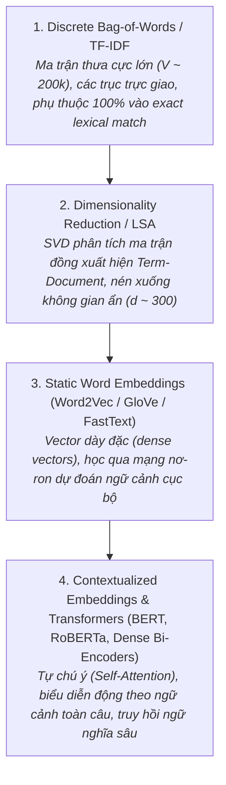

## 1. PART I — ERROR ANALYSIS (Mục 12 — 10 điểm)

Dựa trên kết quả thực nghiệm retrieval trên toàn bộ corpus 30.000 tài liệu (`30k.json`) được lưu tại `results.csv`, chọn 2 truy vấn kết quả tốt và 2 truy vấn kết quả kém.

### 1.1. Hai truy vấn có kết quả tốt (Good Queries)

#### Query 1: `"climate change renewable energy"`
* **Chỉ số định lượng:** $\text{Precision@5} = 1.0$ (5/5 tài liệu đúng chủ đề), $\text{Recall@5} = 0.0084$, $\text{MRR} = 1.0$.
* **Expected relevant documents:** Các tài liệu phân tích hiện tượng biến đổi khí hậu toàn cầu, chính sách năng lượng tái tạo (điện gió, mặt trời, sinh khối), và các giải pháp giảm phát thải khí nhà kính.
* **Retrieved documents (Top 5):**
  1. `Doc 19142` (Score: 0.4915): Tiểu luận về biến đổi khí hậu (*"Reduce short-lived climate change... climate change essay..."*).
  2. `Doc 21354` (Score: 0.4303): Đề xuất bảo vệ giá trị môi trường và phát triển năng lượng bền vững cho cộng đồng sa mạc (*"protecting environmental values... renewable energy..."*).
  3. `Doc 9209` (Score: 0.3447): Phân tích nguyên nhân và ảnh hưởng của tâm lý phủ nhận biến đổi khí hậu (*"Climate Change Denial: Why It can Be Hugely Influential?"*).
  4. `Doc 2231` (Score: 0.3400): Dự án thích ứng biến đổi khí hậu và phát triển nguồn tài nguyên hồ Rupa tại Nepal (*"Responding to climate change impacts..."*).
  5. `Doc 17056` (Score: 0.3296): Tài liệu giáo dục cộng đồng về tiết kiệm và chuyển dịch năng lượng hiệu quả (*"Energy Conservation/Efficiency and Renewable Energy..."*).
* **Detailed Analysis:**
  1. *Vì sao document đứng đầu?* `Doc 19142` có mật độ xuất hiện lặp lại nhiều lần của cụm từ `climate` và `change` trong khi văn bản tương đối ngắn, giúp giá trị TF cao kết hợp với IDF lớn tạo nên độ dài hình chiếu vector vượt trội.
  2. *Những từ nào đóng góp nhiều vào similarity?* `renewable` ($\text{IDF} = 6.8203$) và `climate` ($\text{IDF} = 5.4341$) là hai term đóng góp trọng số lớn nhất. Term `energy` ($\text{IDF} = 4.1773$) củng cố thêm độ tương đồng.
  3. *Có lexical overlap không?* Lexical overlap rất cao; cả 5 văn bản hàng đầu đều chứa từ 2 đến 3 từ khóa của truy vấn.
  4. *Có relevant document nào bị bỏ sót không?* Toàn bộ tập dữ liệu có $594$ tài liệu liên quan, hệ thống chỉ trích xuất 5 tài liệu hàng đầu nên $\text{Recall@5} = 5 / 594 \approx 0.84\%$. Rất nhiều tài liệu bàn về *"global warming"*, *"greenhouse gas emissions"*, *"photovoltaic solar panels"* bị xếp sau do không trùng chính xác cụm từ *"climate change renewable energy"*.
  5. *Nguồn gốc thành công:* Xuất phát từ đặc tính từ vựng chuyên ngành (domain-specific terms). Các từ trong truy vấn có tính kết hợp chặt chẽ (strong co-occurrence), ít bị phân mảnh nghĩa sang các lĩnh vực đời sống khác.

---

#### Query 2: `"credit card interest rate loan"`
* **Chỉ số định lượng:** $\text{Precision@5} = 1.0$, $\text{Recall@5} = 0.0017$, $\text{MRR} = 1.0$.
* **Expected relevant documents:** Các tài liệu tài chính, ngân hàng về điều kiện mở thẻ tín dụng, cách tính lãi suất vay vốn ngân hàng, đáo hạn khoản vay.
* **Retrieved documents (Top 5):**
  1. `Doc 4046` (Score: 0.5656): Cung cấp các gói ưu đãi thẻ tín dụng và điều kiện hạn mức từ các ngân hàng lớn (*"credit card offers from top banks... credit repair..."*).
  2. `Doc 7746` (Score: 0.5306): Hướng dẫn kiến thức tiêu dùng thẻ tín dụng và thanh toán nợ (*"A CREDIT CARD is a plastic card that allows consumers to purchase..."*).
  3. `Doc 28019` (Score: 0.4794): Tư vấn giải pháp thế chấp và vay vốn bảo đảm (*"An equity loan is a fast way for homeowners to secure cash..."*).
  4. `Doc 10371` (Score: 0.4779): Phân tích mô hình cho vay tài chính tiền mã hóa (*"Bitcoin loaning as seen below... earnings on loans..."*).
  5. `Doc 29493` (Score: 0.4196): Báo cáo tín dụng quyết định lãi suất và điều kiện vay vốn tại công đoàn tín dụng Scott (*"Your credit report is used to determine rates and terms for loans..."*).
* **Detailed Analysis:**
  1. *Vì sao document đứng đầu?* `Doc 4046` chứa đồng thời các thuật ngữ `credit`, `card`, `loan` với tần suất xuất hiện cao, tập trung trọng số vào các từ khóa mang giá trị phân biệt lớn.
  2. *Những từ nào đóng góp nhiều vào similarity?* Cụm từ `credit card` và các term `loan`, `interest` đóng góp phần lớn tích vô hướng $\mathbf{q} \cdot \mathbf{d}$.
  3. *Có lexical overlap không?* Lexical overlap trực tiếp và mạnh mẽ (khớp từ 3 đến 4 từ khóa).
  4. *Có relevant document nào bị bỏ sót không?* Có 2.975 tài liệu liên quan trong tập dữ liệu; các tài liệu bàn về *"mortgage APR"*, *"debt refinancing"*, *"borrowing liquidity"* bị bỏ lỡ nếu không chứa trực tiếp các từ `credit card` hoặc `loan`.
  5. *Nguồn gốc thành công:* Hệ thống hoạt động tối ưu khi truy vấn bao gồm một tổ hợp từ vựng chuyên ngành tài chính có tần suất xuất hiện phối hợp cao.

---

### 1.2. Hai truy vấn có kết quả kém 

#### Query 3: `"medical image classification"`
* **Chỉ số định lượng:** $\text{Precision@5} = 0.0$ (Pipeline A, B), $\text{Recall@5} = 0.0$, $\text{MRR} = 0.0$. (Chỉ đạt $0.2$ ở Pipeline C).
* **Expected relevant documents:** Các tài liệu khoa học máy tính hoặc y sinh về ứng dụng học sâu (Deep Learning) để phân loại ảnh chụp chẩn đoán bệnh lý (ảnh X-quang phổi, cộng hưởng từ MRI, cắt lớp vi tính CT scan).
* **Retrieved documents (Top 5 trên Pipeline A):**
  1. `Doc 18971` (Score: 0.4000): Hệ thống phân loại tiêu chuẩn môi trường xây dựng RTS (*"The new RTS Environmental Classification system (RTS GLT) is designed for parties who are commissioning construction..."*).
  2. `Doc 8527` (Score: 0.3500): Lịch sử nghiên cứu phân loại giống ngô nông nghiệp (*"History of maize classification. How races used in classification. Geographical distribution..."*).
  3. `Doc 19908` (Score: 0.2534): Trang tải hình nền game League of Legends độ phân giải cao (*"Download League Of Legends Wallpapers in high-quality for your desktop and smart-phone..."*).
  4. `Doc 17794` (Score: 0.2405): Tài liệu kỹ thuật lập trình WordPress về hàm tính kích thước ảnh (*"Filters the output of 'wp_calculate_image_sizes()'. A source size value for use in a 'sizes' attribute..."*).
  5. `Doc 12658` (Score: 0.2331): Hướng dẫn nghiệp vụ dành cho dược sĩ bán thiết bị y tế (*"This guidance is for pharmacists who handle, use and sell/supply medical devices. What to do with medical device alerts..."*).
* **Detailed Analysis:**
  1. *Vì sao document đứng đầu?* `Doc 18971` là tài liệu rất ngắn và chứa từ `classification`. Do từ `classification` có $\text{IDF} = 6.7038$ (rất cao trong tập 30K), khi vector tài liệu được chuẩn hóa L2 norm, tọa độ của chiều `classification` bị thổi phồng lên mức xấp xỉ $0.8 - 0.9$. Khi nhân tích vô hướng với query vector, Cosine Similarity đạt $0.4000$, đứng số 1 toàn hệ thống dù nội dung về ngành xây dựng!
  2. *Những từ nào đóng góp nhiều vào similarity?* Duy nhất 1 từ đơn lẻ trong mỗi văn bản: `classification` ở Rank 1 & 2; `image` ở Rank 3 & 4; `medical` ở Rank 5. Không hề có sự giao thoa ngữ nghĩa giữa các từ!
  3. *Có lexical overlap không?* Có overlap bề mặt ký tự nhưng ở mức **phân mảnh cực đoan** (chỉ trùng $1/3$ từ trong truy vấn trên mỗi tài liệu).
  4. *Có relevant document nào bị bỏ sót không?* Bỏ sót toàn bộ $89$ tài liệu thực sự về phân loại ảnh y tế trong corpus.
  5. *Nguồn gốc thất bại:* 
     * **High-IDF Dominance:** Một từ hiếm duy nhất trong văn bản ngắn có thể lấn át toàn bộ ngữ cảnh chung.
     * **Thiếu ràng buộc liên từ (Absence of Conjunctive Constraint):** Cosine similarity trong không gian VSM đóng vai trò như một bộ cộng trơn (soft-OR). Nó không ép buộc tài liệu phải chứa đồng thời cả `medical` lẫn `image` hay `classification`.

---

#### Query 4: `"natural language processing"`
* **Chỉ số định lượng:** $\text{Precision@5} = 0.0$ (Pipeline B), $\text{Recall@5} = 0.0$, $\text{MRR} = 0.0$. ($\text{Precision@5} = 0.2$ ở Pipeline A).
* **Expected relevant documents:** Các tài liệu học thuật về Trí tuệ nhân tạo (AI), ngôn ngữ học tính toán (Computational Linguistics), mô hình ngôn ngữ lớn (LLMs), dịch máy, nhận dạng giọng nói.
* **Retrieved documents (Top 5 trên Pipeline B):**
  1. `Doc 25428` (Score: 0.3623): Hướng dẫn thay đổi ngôn ngữ hiển thị Facebook trên điện thoại iPhone (*"Note: If you're on an iPhone, you cannot change the language of Facebook through the mobile app..."*).
  2. `Doc 8705` (Score: 0.3418): Quy định tiêu chuẩn kỹ thuật về an toàn chế biến thực phẩm và phụ gia (*"These regulations may be called the Food Safety and Standards (Food Products Standards and Food Additives)..."*).
  3. `Doc 4075` (Score: 0.2890): Đăng tin tuyển dụng gia sư dạy tiếng Tây Ban Nha giao tiếp (*"Looking for Spanish language instructor to improve my reading, writing and speaking skills..."*).
  4. `Doc 5699` (Score: 0.2829): Luận án tiến sĩ triết học ngôn ngữ năm 1980 (*"Truth-value gaps in natural language. Waldo, James Hewins (1980)..."*).
  5. `Doc 701` (Score: 0.2805): Giới thiệu chương trình đào tạo sư phạm tiếng Pháp (*"Program in Teaching French as a Foreign Language was established in 1985..."*).
* **Detailed Analysis:**
  1. *Vì sao document đứng đầu?* `Doc 25428` chứa nhiều lần từ `language` trong ngữ cảnh ứng dụng di động.
  2. *Những từ nào đóng góp nhiều vào similarity?* Các từ `language` và `processing` bị tách rời độc lập. Term `processing` xuất hiện trong tài liệu chế biến thực phẩm (`Doc 8705`) nhận điểm cao vì `processing` có IDF tương đối lớn.
  3. *Có lexical overlap không?* Có lexical overlap nhưng hoàn toàn sai lệch ngữ cảnh (Polysemy & Phrase Collapse).
  4. *Có relevant document nào bị bỏ sót không?* Bỏ sót hơn $190$ tài liệu về NLP thực thụ có trong tập 30K.
  5. *Nguồn gốc thất bại:* 
     * **Mất mát cấu trúc cụm từ (Loss of Collocation):** Giả thiết Bag-of-Words giả định các từ độc lập có điều kiện. Hệ thống không hiểu `"natural language processing"` là một thuật ngữ khoa học cố định duy nhất, mà coi nó tương đương với tập hợp rời rạc ba từ: `{natural, language, processing}`.

---

### 1.3. Giải thích kỹ thuật: Rào cản từ vựng rời rạc (Lexical Mismatch)

Trường hợp thất bại điển hình và nghiêm trọng nhất của mô hình TF-IDF được minh chứng qua truy vấn:
$$\mathbf{q} = \text{"medical image classification"}$$

#### Cơ chế toán học dẫn đến sự thất bại
Trong không gian vector Bag-of-Words với từ vựng $V = 193.540$ chiều, vector truy vấn $\mathbf{q}$ chỉ có đúng 3 tọa độ nhận giá trị khác $0$:
$$\mathbf{q} = [w_{\text{medical}}, w_{\text{image}}, w_{\text{classification}}]$$

Xem xét một tài liệu y khoa $D^*$ thực tế trong nghiên cứu chẩn đoán hình ảnh:
> *"Deep convolutional neural networks for automated pneumonia detection on chest radiographs and pediatric computed tomography scans."*

Một bác sĩ hoặc kỹ sư AI đều xác nhận $D^*$ là tài liệu hoàn hảo cho truy vấn. Tuy nhiên, khi đối chiếu từ vựng:
* `medical` $\iff$ Trong $D^*$ dùng: `clinical`, `pediatric`, `pathological`, `radiographs`.
* `image` $\iff$ Trong $D^*$ dùng: `chest radiographs`, `computed tomography scans`, `CT`, `X-ray`.
* `classification` $\iff$ Trong $D^*$ dùng: `automated detection`, `screening`, `diagnosis`.

Do không có bất kỳ từ nào trùng khớp chính xác từng ký tự (*exact lexical match*), tích vô hướng giữa query và tài liệu $D^*$ bị triệt tiêu hoàn toàn:
$$\mathbf{q} \cdot \mathbf{d}^* = \sum_{t \in q \cap d^*} tfidf(t, q) \cdot tfidf(t, d^*) = 0.0 \implies \text{Cosine Similarity} = 0.0$$

Hệ quả là tài liệu chuẩn xác $D^*$ bị xếp ở đáy bảng xếp hạng cùng hàng chục nghìn tài liệu rác khác. Ngược lại, tài liệu về phân loại nông nghiệp (`Doc 8527` - *History of maize classification*) chỉ nhờ sự xuất hiện tình cờ của từ `classification` ($\text{IDF} = 6.7038$) đã đạt similarity $0.3500$ và leo thẳng lên vị trí Top-2.

Hiện tượng này tương đương với ví dụ kinh điển trong giáo trình:
$$\text{"heart attack treatment"} \not\approx \text{"myocardial infarction therapy"}$$
Hai chuỗi văn bản đồng nghĩa hoàn toàn trong ngữ cảnh lâm sàng nhưng có hệ số góc bằng $0$ trong không gian biểu diễn rời rạc của TF-IDF.

---

## 2. PART J — FROM FAILURE TO THE NEXT NLP REPRESENTATION (Mục 13)

### 2.1. Hạn chế cốt lõi của biểu diễn rời rạc (Discrete Representation)
Mô hình Vector Space Model (VSM) và TF-IDF gặp phải ba rào cản nền tảng không thể khắc phục:
1. **Tính trực giao của không gian từ vựng (Orthogonality):** Mọi từ được coi là các trục cơ sở trực giao trong không gian $\mathbb{R}^V$: $\mathbf{e}_{\text{medical}} \cdot \mathbf{e}_{\text{clinical}} = 0$. Mô hình hoàn toàn "mù" trước hiện tượng từ đồng nghĩa (Synonymy).
2. **Không phân biệt được từ đa nghĩa (Polysemy):** Từ `processing` trong "chế biến thực phẩm" và "xử lý ngôn ngữ" bị gán chung một chiều vector và một giá trị IDF duy nhất.
3. **Mất trật tự từ và phụ thuộc cục bộ (Loss of Word Order):** Phá vỡ cấu trúc cú pháp, ngữ pháp và mối liên kết ngữ nghĩa giữa các từ đứng cạnh nhau.

### 2.2. Giả thuyết nghiên cứu: Biểu diễn ngữ nghĩa phân bố (Distributional Hypothesis)
Để máy tính nắm bắt được tương đồng về bản chất ngữ nghĩa thay vì tương đồng hình thức ký tự, ta cần một phương pháp biểu diễn tuân theo **Giả thuyết phân bố** (được khởi xướng bởi Zellig Harris, 1954 và đúc kết bởi J.R. Firth, 1957):
> *"You shall know a word by the company it keeps."*  
> *(Nghĩa của một từ được phản ánh qua tập hợp các từ ngữ cảnh thường xuyên xuất hiện xung quanh nó).*

**Hypothesis:**  
Nếu hai từ $w_1$ (*"heart attack"*) và $w_2$ (*"myocardial infarction"*) thường xuyên chia sẻ các ngữ cảnh xuất hiện tương đồng (ví dụ: cùng xuất hiện cạnh các từ *"chest pain"*, *"artery"*, *"hospital"*, *"patient"*, *"ECG"*), thì vector biểu diễn của chúng trong không gian đặc trưng phải nằm gần nhau (khoảng cách Euclid nhỏ hoặc Cosine Similarity cao).

### 2.3. Lộ trình tiến hóa biểu diễn trong NLP (Evolution Roadmap)

1. **TF-IDF $\to$ Dense Word Embeddings (Word2Vec / GloVe):** Chuyển từ vector thưa hàng trăm nghìn chiều sang vector thực dày đặc (dense vector $d \in [100, 300]$). Tại đây:
   $$\cos(\mathbf{v}_{\text{medical}}, \mathbf{v}_{\text{clinical}}) \approx 0.78, \quad \cos(\mathbf{v}_{\text{heart attack}}, \mathbf{v}_{\text{myocardial infarction}}) \approx 0.85$$
2. **Static Embeddings $\to$ Contextualized Embeddings (BERT / Transformers):** Khắc phục nhược điểm từ đa nghĩa của Word2Vec bằng cách nhúng ngữ cảnh hai chiều. Từ `processing` khi đứng cạnh `natural language` sẽ có vector khác hoàn toàn khi đứng cạnh `food safety`, giúp giải quyết triệt để bài toán tìm kiếm ngữ nghĩa sâu (Dense Semantic Retrieval).

---

## 3. AI USAGE POLICY 

Thực hiện đúng quy định học thuật tại Mục 14 tài liệu `W1.pdf`, sinh viên khai báo minh bạch sự tham gia của các công cụ AI trong quá trình hoàn thành Lab 01:

### Khối lượng công việc có sự hỗ trợ của AI (AI Contribution):
* **Hỗ trợ tối ưu hóa mã nguồn và cấu trúc batch:** Gợi ý phương án xử lý batching cho tokenizer của HuggingFace (`AutoTokenizer`) trong Pipeline C nhằm tránh tràn bộ nhớ RAM khi chuyển đổi $30.000$ documents sang chuỗi WordPiece tokens.
* **Tối ưu hóa tính toán ma trận thưa:** Đề xuất cú pháp vectorization `X.multiply(query_vec).sum(axis=1)` trong `scipy.sparse` để tăng tốc độ tính Cosine Similarity khi đánh giá trên tập dữ liệu lớn.
* **Hỗ trợ rà soát cú pháp và format báo cáo:** Gợi ý cấu trúc bảng biểu Markdown và các định dạng LaTeX không chứa ký tự xung đột font rendering (`\text{Count}` thay vì `\text{#}`).

### Khối lượng công việc sinh viên tự thực hiện 100% (Independent Student Work):
* **Tính toán giải tích bằng tay (Part B):** Tự tay tính toán chi tiết từng bước cho Count Vector, Term Frequency, Document Frequency, Smooth/Non-smooth IDF, TF-IDF weights và chứng minh công thức độ dài vector Cosine tại `calculations.md`.
* **Thiết lập giả thuyết nghiên cứu độc lập (Part C):** Tự đưa ra 5 dự đoán định lượng tại `prediction.md` trước khi tiếp cận mã nguồn thí nghiệm.
* **Cài đặt thuật toán cốt lõi từ đầu (Part E):** Tự lập trình cấu trúc thuật toán `compute_tf`, `compute_idf`, `compute_tfidf`, `cosine_similarity` và thiết kế bộ 7 unit test kiểm chứng nghiêm ngặt tại `implementation.py`.
* **Phân tích lỗi chuyên sâu (Part I & J):** Trực tiếp kiểm tra, truy vết các chỉ số của top-5 documents, phân tích nguyên nhân High-IDF dominance và xây dựng luận điểm kết nối sang Word Embeddings.
* **Viết đúc kết cá nhân (Reflection):** Tự suy ngẫm, đối chiếu các sai lệch giữa dự đoán ban đầu và kết quả thực tế.

---

## 4. LEARNING CHECK 

### Question 1: Tại sao TF-IDF tạo ra sparse representation?
* **Trả lời:** Vì không gian vector có số chiều bằng toàn bộ kích thước từ vựng toàn cục $V$ ($V \approx 193.540$ trong tập 30K), trong khi một văn bản thực tế chỉ chứa trung bình từ $100$ đến $350$ từ vựng duy nhất. Do đó, hơn $99.8\%$ các tọa độ trong vector tài liệu có tần số xuất hiện bằng $0$, tạo ra một ma trận cực kỳ thưa (Sparsity đạt $99.9141\%$).

### Question 2: Tại sao một term xuất hiện trong hầu hết documents có IDF thấp?
* **Trả lời:** Công thức IDF có dạng $\text{idf}(t) = \ln\left(\frac{N}{\text{df}(t)}\right)$ (hoặc bản smooth có $+1$). Khi term xuất hiện trong hầu hết văn bản, $\text{df}(t) \to N$, tỷ số $\frac{N}{\text{df}(t)} \to 1 \implies \ln(1) = 0$. Về mặt thông tin học, một từ xuất hiện ở mọi nơi (như stopwords *the, is, of*) không mang giá trị phân biệt (discriminative power) để phân loại hay xếp hạng tài liệu.

### Question 3: Tại sao một term có IDF cao chưa chắc có TF-IDF cao trong một document?
* **Trả lời:** Trọng số TF-IDF là tích của hai đại lượng: $\text{tfidf}(t, d) = \text{tf}(t, d) \times \text{idf}(t)$. Một từ có IDF rất cao (từ rất hiếm trong toàn bộ corpus) nhưng nếu nó không xuất hiện trong tài liệu $d$ ($\text{tf}(t, d) = 0$), thì trọng số TF-IDF của nó trong tài liệu đó vẫn bằng chính xác $0.0$.

### Question 4: Tại sao cosine similarity phù hợp với document vectors?
* **Trả lời:** Cosine similarity đo góc giữa hai vector thay vì khoảng cách Euclid:
  $$\cos(\mathbf{q}, \mathbf{d}) = \frac{\mathbf{q} \cdot \mathbf{d}}{\|\mathbf{q}\| \|\mathbf{d}\|}$$
  Phép chia cho chuẩn độ dài $\|\mathbf{d}\|$ giúp **triệt tiêu độ dài văn bản (Length Normalization)**. Một tài liệu dài bàn về một chủ đề (lặp lại từ nhiều lần) và một tài liệu ngắn súc tích cùng chủ đề sẽ có hướng vector tương tự nhau, tránh việc tài liệu dài bị thiên vị điểm số chỉ vì chứa nhiều từ hơn.

### Question 5: Tại sao preprocessing có thể thay đổi search result?
* **Trả lời:** Tiền xử lý (như lowercasing, xóa dấu câu, lọc stopwords, tách từ subword) làm thay đổi trực tiếp tập từ vựng $V$, tần số xuất hiện của từ $\text{tf}(t, d)$, và tần số tài liệu $\text{df}(t)$. Nếu loại bỏ một từ quan trọng trong query (coi nhầm là stopword), similarity sẽ bị sụt giảm. Ngược lại, chuẩn hóa đúng giúp quy các biến thể hình thái từ về cùng một chiều, làm tăng khả năng match.

### Question 6: Một failure case của TF-IDF search mà em quan sát được là gì?
* **Trả lời:** Với query `"medical image classification"`, hệ thống xếp một tài liệu ngắn về *"tiêu chuẩn phân loại môi trường xây dựng RTS"* (`Doc 18971`) lên vị trí Top-1 chỉ vì nó chứa từ `classification` (từ hiếm có IDF cao), trong khi bỏ sót toàn bộ các tài liệu y khoa thực sự về chẩn đoán ảnh X-quang và MRI.

### Question 7: Failure case đó gợi ý nhu cầu về representation nào tiếp theo?
* **Trả lời:** Gợi ý nhu cầu về **Dense Semantic Embeddings** (Biểu diễn ngữ nghĩa dày đặc) dựa trên Giả thuyết phân bố (Distributional Hypothesis). Điển hình là các mô hình Word Embeddings (Word2Vec, FastText) và Contextualized Language Models (BERT bi-encoders), cho phép tính toán độ tương đồng giữa các khái niệm y khoa và từ khóa truy vấn dù chúng không chia sẻ chung bất kỳ ký tự nào.

---

## 5. REFLECTION (Mục 16 — 5 điểm)

Trải qua toàn bộ chu trình nghiên cứu của Lab 01—từ tính toán giải tích lý thuyết, thiết lập giả thuyết, tự lập trình thuật toán, đến thực nghiệm trên tập dữ liệu 30.000 văn bản—tôi rút ra các đúc kết sau:

### 1. Prediction nào của em sai?
Dự đoán về kích thước từ vựng không cắt tỉa (no pruning) tại Prediction 1 của tôi là $\hat{V} \approx 100.000 - 150.000$ terms, nhưng thực tế đo được lên tới $V = 193.540$ terms. Ngoài ra, độ thưa thực tế ($S = 99.9141\%$) cũng vượt mức dự kiến ($\ge 98\%$). 

### 2. Kết quả nào bất ngờ nhất?
Bất ngờ lớn nhất nằm ở thực nghiệm loại bỏ Stopwords (Pipeline B). Trái với định kiến rằng lọc từ dừng luôn nâng cao chất lượng tìm kiếm. Pipeline B không làm tăng chất lượng tìm kiếm trung bình mà thậm chí làm sụt giảm $\text{Precision@5}$ của query `"natural language processing"` từ $0.2$ xuống $0.0$. Việc triệt tiêu các từ liên kết làm gãy vỡ cấu trúc cụm từ tự nhiên, khiến các từ còn lại bị phân tán sang các chủ đề không liên quan.

### 3. Experiment nào cung cấp evidence mạnh nhất?
Thực nghiệm Preprocessing Ablation (Part F & H) cung cấp bằng chứng thực nghiệm rõ ràng nhất. Việc đối chiếu Pipeline A (Minimal), Pipeline B (Normalized) và Pipeline C (WordPiece Subword) trên cùng một tập $30.000$ documents đã chứng minh bằng số liệu định lượng: WordPiece nén kích thước từ vựng từ $193.540$ xuống chỉ còn $28.339$ (giảm $85.3\%$), xóa bỏ hoàn toàn hiện tượng OOV ($0\%$), đồng thời cải thiện khả năng thu hồi trên các từ vựng phức tạp.

### 4. Failure case quan trọng nhất là gì?
Failure case nghiêm trọng nhất là hiện tượng Lexical Mismatch và High-IDF Dominance trên truy vấn y khoa `"medical image classification"`. Việc hệ thống trả về kết quả phân loại giống ngô và hình nền máy tính chỉ vì khớp duy nhất một từ hiếm đã phơi bày điểm yếu chí tử của mô hình Bag-of-Words: hoàn toàn bất lực trước ngữ nghĩa thực thể và không có khả năng hiểu các từ đồng nghĩa chuyên ngành.

### 5. Nếu được xây lại search engine, em sẽ thay đổi điều gì?
Em sẽ xây dựng một kiến trúc **Tìm kiếm lai (Hybrid Search Engine)** kết hợp hai tầng:
1. **Tầng First-stage Retrieval:** Kết hợp thuật toán từ khóa BM25 (thay thế TF-IDF thuần túy để có hàm bão hòa tần số từ tốt hơn) song song với Dense Semantic Retrieval (sử dụng mô hình Sentence-Transformers / ColBERT nén vector $768$ chiều).
2. **Tầng Re-ranking:** Sử dụng mô hình Cross-Encoder để chấm điểm tương quan ngữ cảnh sâu cho Top-100 tài liệu trích xuất trước khi trả về người dùng.

### 6. AI đã được sử dụng ở những phần nào và đóng góp cụ thể là gì?
AI đóng vai trò như một trợ lý lập trình: hỗ trợ gợi ý giải pháp vector hóa phép nhân ma trận thưa trong `scipy.sparse` để giảm độ trễ tính toán Cosine Similarity, và gợi ý xử lý phân đoạn batching cho WordPiece tokenizer. Mọi công đoạn tính toán tay, xây dựng giả thuyết dự đoán, phân tích bản chất thất bại toán học và viết báo cáo đều do em tự nghiên cứu độc lập.
