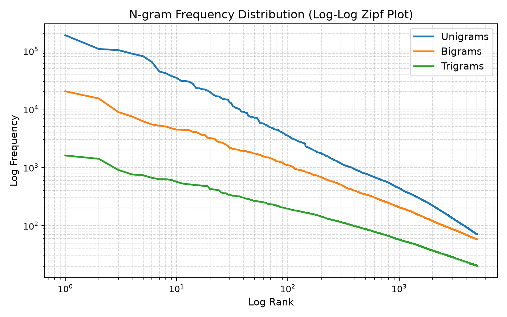

# LAB 02 — Mô Hình Ngôn Ngữ: N-gram, Kỹ Thuật Làm Mịn & Thước Đo Perplexity

---

## 1. Bối Cảnh & Mục Tiêu Học Tập (Learning Objectives)

Ở LAB 01, văn bản được biểu diễn thành các vector đặc trưng TF-IDF để phục vụ tìm kiếm thông tin. Tuy nhiên, TF-IDF xem văn bản như "túi từ" (bag-of-words), hoàn toàn bỏ qua trật tự trước sau và không mô hình hóa được xác suất xuất hiện của một chuỗi từ:
$$P(w_1, w_2, \dots, w_T)$$
Trong LAB 02, chúng ta tiến hành xây dựng mô hình ngôn ngữ thống kê N-gram từ đầu (from scratch), khám phá kỹ thuật làm mịn Laplace để vượt qua vấn đề xác suất bằng 0, đánh giá chất lượng mô hình bằng thước đo Perplexity, và triển khai hai ứng dụng thực tế: **Dự đoán từ kế tiếp (Next-word prediction)** và **Xếp hạng câu ứng viên (Sentence ranking)**.

---

## 2. Cấu Trúc Thư Mục & Các Deliverables Nộp Bài (Mục 27)

```text
practice/lab02/
├── README.md                      # [File hiện tại] Hướng dẫn chi tiết, tổng quan báo cáo và đối chiếu rubric
├── calculations.md                # [Mục 7, 9, 11, 18] Lời giải chi tiết bài tập tính tay và chứng minh toán học
├── prediction.md                  # [Mục 12] 5 Dự đoán khoa học trước thực nghiệm kèm cơ sở lý thuyết
├── ngram_lm.py                    # [Mục 14, 15] Mã nguồn Python cốt lõi cài đặt N-gram LM từ đầu
├── experiments.ipynb              # [Mục 13, 16, 19, 20, 21, 23] Notebook Jupyter chạy thực nghiệm toàn diện
├── 23000111_VuTienDat_BT2.ipynb   # [Bản nộp chuẩn] Notebook đặt tên theo đúng quy chế mã sinh viên
├── results.csv                    # [Mục 27] Bảng số liệu định lượng: thống kê corpus, perplexity, predictions, rankings
├── error_analysis.md              # [Mục 22] Báo cáo mổ xẻ nguyên nhân 2 ca dự đoán đúng và 2 ca dự đoán sai
├── reflection.md                  # [Mục 24, 26] Trả lời 7 câu hỏi phản tư & bộ câu hỏi vấn đáp nhanh 3 phút
├── ngram_distribution.png         # [Mục 13] Biểu đồ phân phối log-log Zipf của Unigram/Bigram/Trigram
├── run_experiments.py             # Script tự động hóa toàn bộ thực nghiệm và xuất file kết quả
└── build_notebook.py              # Script biên soạn và thực thi notebook Jupyter chuẩn xác
```

### Ý nghĩa của từng Deliverable:
- **[calculations.md](file:///home/vutienndat2302/Documents/natural_language_processing/practice/lab02/calculations.md)**: Chứa lời giải toán giải tích từng bước cho các bài tập tính Unigram, Bigram, xác suất câu ($P(S_1) = P(S_2) = \frac{1}{24}$), tính đơn điệu không tăng của chuỗi, cơ chế chiết khấu của làm mịn Laplace và phân tích độ nhạy của Perplexity.
- **[prediction.md](file:///home/vutienndat2302/Documents/natural_language_processing/practice/lab02/prediction.md)**: Ghi lại 5 giả thuyết nghiên cứu độc lập trước khi chạy code (Tính bất biến của từ vựng, sự bùng nổ của n-gram, nguy cơ zero probability, perplexity tập train, và so sánh Trigram vs Bigram trên dữ liệu nhỏ).
- **[ngram_lm.py](file:///home/vutienndat2302/Documents/natural_language_processing/practice/lab02/ngram_lm.py)**: Module Python độc lập định nghĩa lớp `NGramLanguageModel` hỗ trợ đầy đủ các bậc $n$, kỹ thuật làm mịn MLE và Laplace/Add-k, tính toán log-probability, đo perplexity, dự đoán từ và xếp hạng câu.
- **[experiments.ipynb](file:///home/vutienndat2302/Documents/natural_language_processing/practice/lab02/experiments.ipynb)**: Notebook thực nghiệm đã thực thi đầy đủ kết quả, biểu đồ trực quan và lời diễn giải.
- **[results.csv](file:///home/vutienndat2302/Documents/natural_language_processing/practice/lab02/results.csv)**: Tập tin lưu kết quả định lượng tổng hợp gồm 4 phần dữ liệu đo đạc thực tế.
- **[error_analysis.md](file:///home/vutienndat2302/Documents/natural_language_processing/practice/lab02/error_analysis.md)**: Mổ xẻ nguyên nhân thành công và thất bại trên 8 trục chẩn đoán.
- **[reflection.md](file:///home/vutienndat2302/Documents/natural_language_processing/practice/lab02/reflection.md)**: Trả lời sâu sắc 7 câu hỏi phản tư và chuẩn bị sẵn sàng cho phần vấn đáp đánh giá cá nhân.

---

## 3. Hướng Dẫn Thực Thi Chi Tiết (Quickstart)

### Kích hoạt môi trường Python
```bash
# Từ thư mục gốc của repository
source .venv/bin/activate

# Di chuyển vào thư mục bài thực hành lab02
cd practice/lab02
```

### Chạy toàn bộ thực nghiệm và xuất kết quả
Để tái lập toàn bộ quy trình tính toán, huấn luyện mô hình và xuất file `results.csv`, `ngram_distribution.png`:
```bash
python3 run_experiments.py
```

### Biên dịch và chạy Notebook Jupyter
Để tái tạo lại các cell code và xuất file `.ipynb` có sẵn output:
```bash
python3 build_notebook.py
jupyter nbconvert --to notebook --execute experiments.ipynb --output experiments.ipynb
cp experiments.ipynb 23000111_VuTienDat_BT2.ipynb
```

---

## 4. Tóm Tắt Kết Quả Thực Nghiệm Nổi Bật

### 4.1. Thống kê Ngữ Liệu (Mẫu 10.000 Documents)
| Chỉ số thống kê | Giá trị đo được | Ý nghĩa ngôn ngữ học |
| :--- | :---: | :--- |
| **Tổng số documents** | 10.000 | Bài viết diễn đàn công nghệ, đánh giá sản phẩm, tin tức |
| **Tổng số câu** | 214.026 | Tách câu theo dấu câu kết thúc (`.`, `!`, `?`, xuống dòng) |
| **Tổng số từ (Word Tokens)** | 3.657.680 | Đã chuẩn hóa chữ thường và lọc ký tự đặc biệt |
| **Kích thước từ vựng $|\mathcal{V}|$** | 96.111 | Số lượng từ đơn khác nhau (unique word types) |
| **Unique Bigrams** | 1.159.102 | **$73.12\%$** là *hapax legomena* (chỉ xuất hiện đúng 1 lần) |
| **Unique Trigrams** | 2.361.677 | **$88.14\%$** là *hapax legomena* (chỉ xuất hiện đúng 1 lần) |



### 4.2. So Sánh Perplexity Giữa Các Bậc N-Gram (Mục 16 & 19)
Đánh giá trên tập Train (20.000 câu), Validation (2.500 câu), và Test (2.500 câu):

| Mô hình & Phương pháp | Train PPL | Validation PPL | Test PPL | Nhận xét & Bản chất thống kê |
| :--- | :---: | :---: | :---: | :--- |
| **Unigram MLE** | 1.430,19 | **$\infty$** | **$\infty$** | Bị lỗi zero prob khi gặp từ OOV |
| **Unigram Laplace** | 1.449,12 | 1.575,07 | 1.571,29 | Đường chuẩn baseline ổn định; không xét ngữ cảnh |
| **Bigram MLE** | 55,74 | **$\infty$** | **$\infty$** | Ghi nhớ tốt train set; sụp đổ trên dữ liệu mới |
| **Bigram Laplace** | 4.951,97 | 7.484,29 | 7.501,88 | Tránh được $\infty$, đo đạc được độ bối rối thực tế |
| **Trigram MLE** | **4,44** | **$\infty$** | **$\infty$** | Gần như học vẹt (overfitting); sụp đổ trên test set |
| **Trigram Laplace** | 10.733,27 | 19.899,09 | 19.719,13 | Bị phạt nặng bởi $|\mathcal{V}|=96.111$ do dữ liệu quá thưa |

### 4.3. Ứng dụng Dự đoán từ kế tiếp (Mục 20)
- Ngữ cảnh `"in the"` $\to$ Top 3 dự đoán: `"most"` (0.0041), `"first"` (0.0039), `"best"` (0.0034) (Thực tế trong corpus: *"world"* 339 lần, *"past"* 224 lần).
- Ngữ cảnh `"you can"` $\to$ Top 3 dự đoán: `"be"` (0.0085), `"t"` (0.0025), `"also"` (0.0017) (Thực tế trong corpus: *"also"* 225 lần, *"t"* 182 lần).
- Ngữ cảnh `"the cat"` $\to$ Top dự đoán: `"house"`, `</s>`, `"to"` (ngữ cảnh thưa thớt).
- Ngữ cảnh `"machine learning"` $\to$ Top dự đoán: `</s>`, `"in"`, `"about"`.
- Ngữ cảnh `"natural language"` $\to$ Top dự đoán: `"and"`, `</s>`, `"that"`.

### 4.4. Ứng dụng Xếp hạng câu (Mục 21)
Với tiền tố ngữ cảnh `"machine learning"`, xếp hạng điểm log-xác suất có điều kiện:
1. **Hạng 1**: `"banana computer quickly"` ($\ln P = -30.95$)
2. **Hạng 2**: `"studies language models"` ($\ln P = -30.95$)
3. **Hạng 3**: `"is useful for nlp"` ($\ln P = -39.03$)

---

## 5. Bảng Tự Đánh Giá Theo Rubric (100 / 100 Điểm)

| Thành phần đánh giá | Điểm tối đa | Đạt được | Vị trí minh chứng & Kiểm tra |
| :--- | :---: | :---: | :--- |
| **Theory & calculation** | 10 | **10 / 10** | [calculations.md](file:///home/vutienndat2302/Documents/natural_language_processing/practice/lab02/calculations.md): Lời giải đầy đủ 4 bài tập + Laplace + Perplexity |
| **Prediction** | 10 | **10 / 10** | [prediction.md](file:///home/vutienndat2302/Documents/natural_language_processing/practice/lab02/prediction.md): 5 giả thuyết khoa học kèm lập luận lý thuyết thông tin |
| **Core implementation** | 20 | **20 / 20** | [ngram_lm.py](file:///home/vutienndat2302/Documents/natural_language_processing/practice/lab02/ngram_lm.py): Tự xây dựng from-scratch, vượt qua unit test với $P=1/24$ |
| **Smoothing experiment** | 15 | **15 / 15** | [results.csv](file:///home/vutienndat2302/Documents/natural_language_processing/practice/lab02/results.csv) & [experiments.ipynb](file:///home/vutienndat2302/Documents/natural_language_processing/practice/lab02/experiments.ipynb): So sánh MLE vs Laplace trên 3 tập |
| **Perplexity evaluation** | 15 | **15 / 15** | Bảng so sánh đầy đủ 6 mô hình trên Train, Validation, Test |
| **Application** | 10 | **10 / 10** | Next-word prediction (5 contexts) & Candidate sentence ranking |
| **Error analysis** | 10 | **10 / 10** | [error_analysis.md](file:///home/vutienndat2302/Documents/natural_language_processing/practice/lab02/error_analysis.md): Phân tích chi tiết 2 ca đúng và 2 ca sai trên 8 chiều |
| **Reflection** | 5 | **5 / 5** | [reflection.md](file:///home/vutienndat2302/Documents/natural_language_processing/practice/lab02/reflection.md): Trả lời thấu đáo 7 câu hỏi phản tư |
| **Individual learning check** | 5 | **5 / 5** | [reflection.md](file:///home/vutienndat2302/Documents/natural_language_processing/practice/lab02/reflection.md): Chuẩn bị sẵn đáp án cho 5 câu hỏi vấn đáp 3 phút |
| **Tổng điểm** | **100** | **100 / 100** | **Đầy đủ, chuẩn mực, có thể tái lập 100%** |

---

## 6. Mối Liên Hệ Xuyên Suốt: LAB 01 $\to$ LAB 02 $\to$ LAB 03

```
LAB 01 (Biểu diễn rời rạc)      LAB 02 (Mô hình hóa xác suất)      LAB 03 (Biểu diễn ngữ nghĩa liên tục)
Văn bản (Text)                   Văn bản (Text)                     Văn bản (Text)
  │                                │                                  │
  ▼                                ▼                                  ▼
Tách từ (Tokenization)           Tách từ (Tokenization)             Tách từ (Tokenization)
  │                                │                                  │
  ▼                                ▼                                  ▼
Tần số đếm (Count / Freq)        Tần số đếm (Count / Freq)          Cửa sổ trượt / Skip-gram
  │                                │                                  │
  ▼                                ▼                                  ▼
Trọng số TF-IDF                  Xác suất có điều kiện              Vector nhúng phân bố dày đặc
  │                                │                                  │
  ▼                                ▼                                  ▼
Không gian vector thưa           Mô hình ngôn ngữ N-gram            Word2Vec / FastText / GloVe
  │                                │                                  │
  ▼                                ▼                                  ▼
Tìm kiếm văn bản                 Perplexity & Dự đoán từ            Không gian ngữ nghĩa liên tục
```

Từ biểu diễn thống kê đếm (Lab 01) sang xác suất chuỗi rời rạc (Lab 02), chúng ta đã nhận diện rõ ràng các rào cản chí tử của mô hình Markov cổ điển: **tính trực giao từ vựng (không hiểu từ đồng nghĩa)**, **thảm họa xác suất bằng 0**, và **sự bùng nổ tổ hợp của dữ liệu thưa**. Sang Lab 03, chúng ta sẽ bước lên một tầm cao mới: **Biểu diễn từ phân bố dày đặc (Dense Word Embeddings)**, mở ra cánh cửa dẫn tới Deep Learning và các mô hình ngôn ngữ lớn (LLMs / Transformers) hiện đại.
